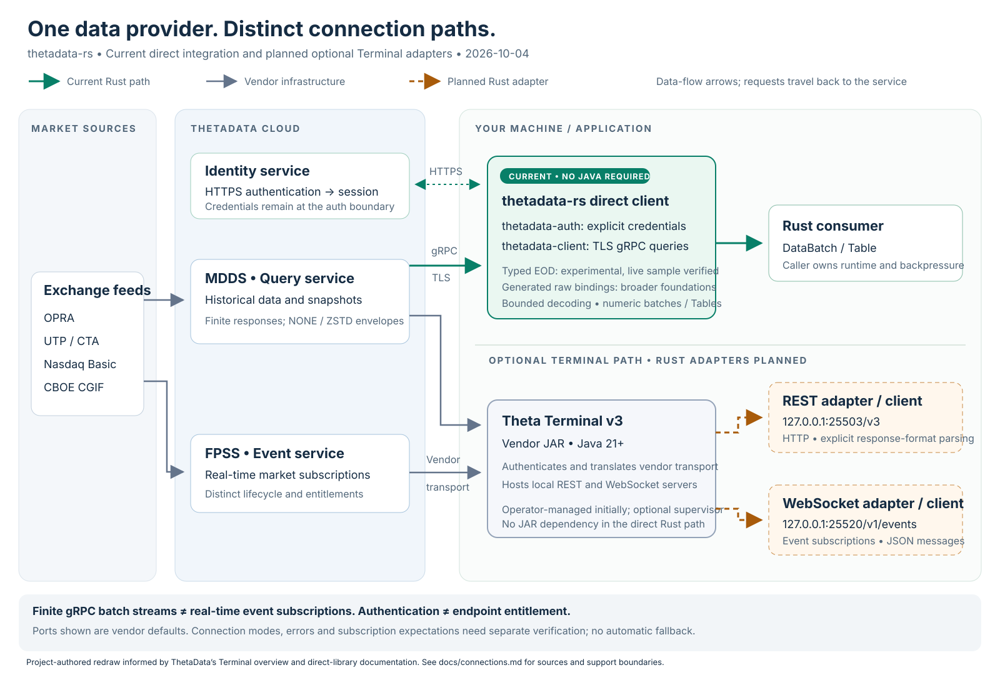

# ThetaData connection points and support boundaries

The current Rust implementation uses **hosted HTTPS authentication followed by
direct TLS gRPC market-data queries**. It does not need Theta Terminal or Java.
Theta Terminal v3 is a separate vendor gateway; its local REST and WebSocket
interfaces require optional Rust adapters that are **not implemented yet**.

[Open the editable SVG](diagrams/thetadata-connections.svg). This project-authored
redraw separates our current path from the Terminal path in the vendor's
[original diagram](https://thetadata.net/docs/assets/ThetaTerminal.drawio.BNKjUg78.png).
Boxes/edges show responsibilities and data delivery, not every packet exchange.
It does not repeat vendor throughput marketing as a measured Rust result.

## Connection inventory

| Connection | Address / protocol | Identity and lifecycle | Current project support |
| --- | --- | --- | --- |
| Hosted identity | `https://nexus-api.thetadata.us/identity/terminal/auth_user` | Explicit API key or email/password; yields environment-bound session; HTTP status domain | `thetadata-auth`; CLI authenticates/persists, manual tests retain session only in memory |
| Direct PROD MDDS | `https://mdds-01.thetadata.us:443`, gRPC over TLS | Session UUID/email hint in query envelope; finite server-streaming batches | `thetadata-client`; typed EOD experimental with one real-query observation; generated raw helpers are broader foundations |
| Direct STAGE MDDS | `https://mdds-stage.thetadata.us:443`, gRPC over TLS | Independently authenticated environment; separate connection | Explicit config supported; not an assumed testing sandbox or free entitlement bypass |
| Terminal v3 REST | Normally `http://127.0.0.1:25503/v3` | Terminal owns its service session; caller talks to local HTTP gateway | Planned optional adapter; no current REST client implementation |
| Terminal WebSocket events | Normally `ws://127.0.0.1:25520/v1/events` | Long-lived JSON event subscription over Terminal/FPSS; its own connection/subscription lifecycle | Planned adapter; finite gRPC batch streams are not this feature |
| Flat-file download | URLs/manifests returned by selected APIs | Separate download/integrity/expiry/storage contracts | Planned; table path deliberately rejects manifests |
| Local protocol fixture | Ephemeral loopback HTTP auth and gRPC listeners | Synthetic identity and constructed or private captured messages | Existing credential-free tests and manual offline replay; never the actual Theta Terminal |

The first three mappings come from the pinned Python artifact and current Rust
configuration; they are not extracted from the Terminal OpenAPI server URL.
REST/WebSocket defaults are documented vendor addresses and are configurable.
Do not point the gRPC client at the REST port or send a hosted session token to
an arbitrary local/remote HTTP URL. Connector choice must be explicit.

## Errors are transport-specific

| Situation | Direct typed EOD API today | Raw API today | Future Terminal adapter |
| --- | --- | --- | --- |
| Endpoint access denied | `EodError::Remote(tonic::Code::PermissionDenied)` | `Error::Rpc(status)` or generated `tonic::Status`; code preserved | Map documented HTTP 471 permission error explicitly; do not interpret it as a gRPC numeric code |
| Missing/invalid authentication | `Remote(Unauthenticated)` on a query; auth HTTP failure is separate | gRPC code / `AuthError::Rejected(http_status)` | Separate Terminal session/config/HTTP error contract |
| No data | `EodError::NoData` for gRPC NOT_FOUND | `Error::NoData` in raw helper; generated stub retains NOT_FOUND | HTTP 472 is the documented Terminal no-data response |
| Other non-OK gRPC status | `Remote(code)` for each code, including Unavailable and ResourceExhausted | Status retained | Preserve original HTTP/status domain and define explicit mappings |
| Local deadline, cancellation, decoding or resource failure | Distinct `Deadline`, `Idle`, `Cancelled`, `Decode`, `Schema`, `Unsupported`, `Resource(...)` variants | Legacy raw errors have different granularity | Must distinguish local failures from upstream and Terminal failures |

The synthetic [EOD contracts](../crates/thetadata-client/tests/eod_contracts.rs)
exercise all sixteen non-OK gRPC statuses on numeric and Table paths, at initial
headers and after a valid batch. NOT_FOUND alone maps to no-data. Permission
denial is never an empty success and does not cause an automatic retry, login,
upgrade recommendation, or transport switch. Typed errors omit vendor text and
metadata; raw status messages can contain sensitive information, so do not print
raw Debug output into shared logs. A status alone cannot prove the account tier
or reason for rejection; the user's provided message supplies that context here.

The [subscription test plan](subscription-testing.md) keeps expected denial tests
distinct from data-success tests and records evidence per product, tier, endpoint
and transport. None of this creates a local entitlement enforcement policy.

## How we will support the JAR

Use [ADR-0018](adr/0018-explicit-connection-adapters.md) and the
[CONN requirements](requirements/connections.md) to implement in order:

1. An optional REST adapter connecting to an **operator-started** Terminal v3.
   Define exact value/format semantics, HTTP errors, deadlines and bounded
   incremental output before declaring parity with numeric direct delivery.
2. Optional Terminal process supervision as separate application/tooling code:
   explicit user-supplied JAR/config, version/hash recording, bounded readiness
   checks, safe logs, and stop only the process this application started.
   Startup auto-update behavior needs provenance; no silent download/update or
   JAR redistribution. Connecting to an existing Terminal must not own its lifetime.
3. A separate WebSocket event adapter for subscription acknowledgements,
   disconnects, re-subscription, gaps, ordering and bounded consumer queues.
   Test entitlements and backpressure independently from finite HTTP/gRPC queries.

Java stays outside auth/core/direct-client dependencies. Merely launching the
JAR does not implement a REST or streaming client. No Terminal was downloaded or
started by this documentation work, and no public crate name is being reserved.

## Sources and limitations

Reviewed 2026-10-04. The [Python guide](https://thetadata.net/docs/Python-Library/Getting-Started.html)
describes direct access; the [Terminal guide](https://thetadata.net/docs/Articles/Getting-Started/Getting-Started.html)
describes the Java gateway, Java 21+ and startup updates. Some older page sections
still say Terminal/credential files are universally required; those statements
must not override the documented direct-library/API-key path.

The [streaming guide](https://thetadata.net/docs/Streaming/Getting-Started.html)
documents the event endpoint and a single connection distributing events to
consumers. It also documents an FPSS development replay environment; that is
distinct from MDDS STAGE, and does not establish free streaming permissions.
The [HTTP error reference](https://thetadata.net/docs/Articles/Errors-Exchanges-Conditions/Error-Codes.html)
defines Terminal status codes, not hosted identity/gRPC behavior. Keep source
research, observations and project policy separate when these references change.
